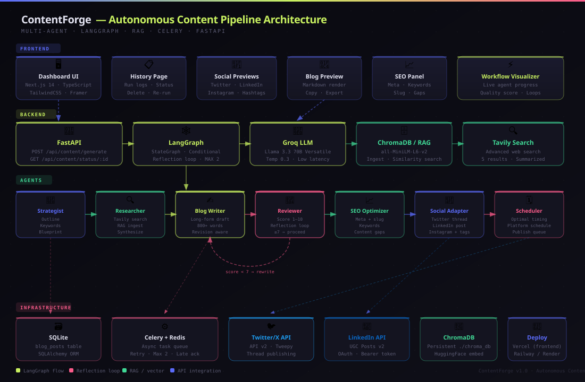

# ⚡ ContentForge — Autonomous Content Pipeline

> A production-grade, 7-agent LangGraph pipeline that researches any topic, writes SEO-optimized long-form articles, adapts content for Twitter/X, LinkedIn, and Instagram, scores its own quality, and schedules publishing — all without manual intervention.
---

### 🚀 Try It Live

Experience the **ContentForge** autonomous pipeline firsthand:

👉 **[Launch ContentForge Dashboard](https://your-vercel-link.com)**  


#### 🎥 Demo Showcase
Watch the 7-agent pipeline in action, from topic research to social media scheduling:

[](https://your-video-link.com)

---
## Architecture



---

## 📋 Table of Contents

- [Overview](#overview)
- [Architecture](#architecture)
- [Agent Roles](#agent-roles)
- [Tech Stack](#tech-stack)
- [Project Structure](#project-structure)
- [Local Setup](#local-setup)
- [Environment Variables](#environment-variables)
- [Running the Project](#running-the-project)
- [Deploy to Vercel + GitHub](#deploy-to-vercel--github)
- [API Reference](#api-reference)
- [Files Created / Modified](#files-created--modified)

---

## Overview

ContentForge orchestrates 7 specialized AI agents using LangGraph's stateful graph to turn a topic + audience into:

- ✅ A structured content outline (SEO keywords, personas, structure)
- ✅ A long-form, research-backed blog article (800+ words)
- ✅ An SEO package (meta title, description, slug, keywords)
- ✅ Platform-specific social posts (Twitter thread, LinkedIn, Instagram + hashtags)
- ✅ An AI-generated optimal publishing schedule
- ✅ One-click publishing to Twitter/X and LinkedIn

A reflection loop re-sends articles scoring below **7/10** back to the Writer (max 2 revisions).

---

## Architecture

```
User Input (topic + audience)
        │
        ▼
  [FastAPI] ──► [Celery Task] ──► [LangGraph Workflow]
                                         │
          ┌──────────────────────────────┤
          │                              │
    [Strategist]                  [Researcher]
    Outline + keywords            Tavily search + RAG
          │                              │
          └──────────────┬───────────────┘
                         ▼
                    [Blog Writer]
                    Long-form draft
                         │
                    [Reviewer] ◄─── score < 7 loops back
                    Score 1-10       (max 2 revisions)
                         │ score ≥ 7
                    [SEO Optimizer]
                    Meta, slug, keywords
                         │
                    [Social Adapter]
                    Twitter · LinkedIn · Instagram
                         │
                    [Scheduler Agent]
                    Optimal publish timing
                         │
                    [SQLite DB] ← results persisted
                         │
                    [Frontend Poll] ← 3s interval
```

---

## Agent Roles

| # | Agent | Role | Output |
|---|-------|------|--------|
| 1 | **Content Strategist** | Builds SEO content blueprint | Outline, keyword map, persona |
| 2 | **Research Agent** | Tavily web search + RAG retrieval | Synthesized research summary |
| 3 | **Blog Writer** | Writes long-form article | 800+ word Markdown article |
| 4 | **Quality Reviewer** | Scores quality, generates revision notes | Score (1-10) + feedback |
| 5 | **SEO Optimizer** | Builds full SEO package | Meta, keywords, slug, gaps |
| 6 | **Social Media Adapter** | Platform-specific content | Twitter thread, LinkedIn, Instagram |
| 7 | **Scheduler Agent** | Optimal publish timing | ISO 8601 schedule per platform |

---

## Tech Stack

| Layer | Technology |
|-------|-----------|
| **Frontend** | Next.js 14, TypeScript, TailwindCSS, Framer Motion |
| **Backend** | FastAPI, Python 3.11+ |
| **Orchestration** | LangGraph (StateGraph + conditional edges) |
| **LLM** | Groq API — Llama 3.3 70B Versatile |
| **RAG** | ChromaDB + HuggingFace `all-MiniLM-L6-v2` |
| **Research** | Tavily Search API |
| **Task Queue** | Celery + Redis |
| **Database** | SQLite (SQLAlchemy ORM) |
| **Publishing** | Twitter API v2 (Tweepy), LinkedIn UGC Posts API |
| **Deployment** | Vercel (frontend), Railway/Render (backend) |

---

## Project Structure

```
Social Media Content/
├── architecture.svg              ← System architecture diagram
├── README.md
│
├── backend/
│   ├── .env                      ← Environment variables (never commit real keys)
│   ├── requirements.txt
│   └── app/
│       ├── main.py               ← FastAPI app, CORS, router registration
│       ├── config.py             ← Pydantic Settings (all env vars)
│       ├── agents/
│       │   ├── strategist.py     ← Agent 1: Content blueprint
│       │   ├── researcher.py     ← Agent 2: Tavily + RAG
│       │   ├── writer.py         ← Agent 3: Long-form article
│       │   ├── reviewer.py       ← Agent 4: Score + reflection
│       │   ├── seo.py            ← Agent 5: SEO package
│       │   ├── social.py         ← Agent 6: Social posts
│       │   ├── scheduler_agent.py← Agent 7: Publish timing
│       │   └── analytics.py      ← Analytics stub
│       ├── graph/
│       │   └── workflow.py       ← LangGraph StateGraph definition
│       ├── db/
│       │   ├── database.py       ← SQLAlchemy engine + session
│       │   └── models.py         ← BlogPost ORM model
│       ├── routes/
│       │   └── content.py        ← REST API endpoints
│       ├── rag/
│       │   ├── vector_store.py   ← ChromaDB ingest + query
│       │   └── embeddings.py
│       ├── scheduler/
│       │   ├── celery_worker.py  ← Celery app configuration
│       │   └── tasks.py          ← Celery pipeline task
│       ├── integrations/
│       │   ├── twitter.py        ← Twitter/X API publisher
│       │   └── linkedin.py       ← LinkedIn API publisher
│       └── utils/
│           ├── groq_client.py    ← Groq LLM client
│           ├── logger.py         ← Structured logging
│           └── prompts.py        ← All agent system prompts
│
└── frontend/
    ├── .env.local                ← NEXT_PUBLIC_API_URL
    ├── next.config.js
    ├── tailwind.config.js
    ├── tsconfig.json             ← Path aliases (@/*)
    ├── package.json
    ├── types/
    │   └── index.ts              ← TypeScript types (BlogPost, etc.)
    ├── lib/
    │   └── api.ts                ← Axios API client
    ├── app/
    │   ├── layout.tsx            ← Root layout + Google Fonts
    │   ├── globals.css           ← Tailwind + CSS variables
    │   ├── page.tsx              ← Redirect → /dashboard
    │   ├── dashboard/
    │   │   ├── layout.tsx        ← Sidebar wrapper
    │   │   └── page.tsx          ← Main dashboard with tabs
    │   └── history/
    │       ├── layout.tsx
    │       └── page.tsx          ← Run history + delete
    └── components/
        ├── Sidebar.tsx           ← Navigation sidebar
        ├── TopicForm.tsx         ← Pipeline launch form
        ├── WorkflowStatus.tsx    ← Live agent timeline
        ├── BlogPreview.tsx       ← Article display + copy
        ├── SEOPanel.tsx          ← SEO fields display
        └── SocialPreview.tsx     ← Twitter/LinkedIn/Instagram cards
```

---

## Local Setup

### Prerequisites

- Python 3.11+
- Node.js 18+
- Redis (running locally)

### 1. Clone the repo

```bash
git clone https://github.com/YOUR_USERNAME/contentforge.git
cd contentforge
```

### 2. Backend Setup

```bash
cd backend

# Create and activate virtual environment
python -m venv venv
source venv/bin/activate        # Windows: venv\Scripts\activate

# Install dependencies
pip install -r requirements.txt

# Copy and fill environment variables
cp .env .env.local
# → Edit .env with your real API keys (see Environment Variables below)
```

### 3. Frontend Setup

```bash
cd frontend
npm install
```

---

## Environment Variables

Create `backend/.env` with these values:

```env
# ── Required ──────────────────────────────────────────────
GROQ_API_KEY=your_groq_api_key_here        # https://console.groq.com
TAVILY_API_KEY=your_tavily_api_key_here    # https://tavily.com

# ── Database ───────────────────────────────────────────────
DATABASE_URL=sqlite:///./content_db.db

# ── Task Queue ─────────────────────────────────────────────
REDIS_URL=redis://localhost:6379

# ── App ────────────────────────────────────────────────────
APP_ENV=development
LOG_LEVEL=INFO

# ── Social Media (Optional — for publishing) ───────────────
TWITTER_API_KEY=
TWITTER_API_SECRET=
TWITTER_ACCESS_TOKEN=
TWITTER_ACCESS_SECRET=

LINKEDIN_ACCESS_TOKEN=
LINKEDIN_PERSON_URN=
```

Create `frontend/.env.local`:

```env
NEXT_PUBLIC_API_URL=http://localhost:8000
```

---

## Running the Project

> ⚡ **Windows users:** No Redis or Celery needed. The pipeline runs in FastAPI background threads. See `backend/WINDOWS_SETUP.md` for the quick guide.

### Windows & macOS/Linux — Just 2 terminals

#### Terminal 1 — FastAPI Backend

**Windows:**
```cmd
cd backend
python -m venv venv
venv\Scripts\activate
pip install -r requirements.txt
uvicorn app.main:app --reload --host 0.0.0.0 --port 8000
```

**macOS / Linux:**
```bash
cd backend
python -m venv venv
source venv/bin/activate
pip install -r requirements.txt
uvicorn app.main:app --reload --host 0.0.0.0 --port 8000
```

API docs: http://localhost:8000/docs

#### Terminal 2 — Next.js Frontend

```bash
cd frontend
npm install
npm run dev
```

Open http://localhost:3000 ✅

---

### Optional: Celery + Redis (production scale-out)

Only needed if you want distributed task workers. Requires Redis running.

```bash
# Start Redis (Docker — works on all platforms)
docker run -d -p 6379:6379 redis:alpine

# Start Celery worker
cd backend && source venv/bin/activate
celery -A app.scheduler.celery_worker.celery worker --loglevel=info
```

Then uncomment `REDIS_URL` in `backend/.env`.

---

## Deploy to Vercel + GitHub

### Step 1: Push to GitHub

```bash
git init
git add .
git commit -m "feat: ContentForge autonomous pipeline"
git branch -M main
git remote add origin https://github.com/YOUR_USERNAME/contentforge.git
git push -u origin main
```

> ⚠️ Make sure `.gitignore` excludes `.env`, `venv/`, `chroma_db/`, `*.db`, `.next/`

### Step 2: Deploy Frontend to Vercel

1. Go to [vercel.com](https://vercel.com) → **New Project**
2. Import your GitHub repository
3. Set **Root Directory** to `frontend`
4. Set **Framework Preset** to `Next.js`
5. Add environment variable:
   ```
   NEXT_PUBLIC_API_URL = https://your-backend-url.railway.app
   ```
6. Click **Deploy**

### Step 3: Deploy Backend

**Option A — Railway (recommended, free tier available)**

1. Go to [railway.app](https://railway.app) → **New Project** → **Deploy from GitHub**
2. Select your repo, set root to `backend`
3. Add a Redis service (Railway has a built-in Redis plugin)
4. Set all environment variables from `backend/.env`
5. Set start command:
   ```
   uvicorn app.main:app --host 0.0.0.0 --port $PORT
   ```
6. For Celery worker, add a second service in Railway with start command:
   ```
   celery -A app.scheduler.celery_worker.celery worker --loglevel=info
   ```

**Option B — Render**

1. Go to [render.com](https://render.com) → **New Web Service**
2. Connect GitHub repo, root directory `backend`
3. Build command: `pip install -r requirements.txt`
4. Start command: `uvicorn app.main:app --host 0.0.0.0 --port $PORT`
5. Add a separate **Background Worker** for Celery with:
   ```
   celery -A app.scheduler.celery_worker.celery worker --loglevel=info
   ```
6. Add Redis via Render's Redis service or Upstash

### Step 4: Update Vercel Environment

After deploying the backend, go back to Vercel → Project Settings → Environment Variables and update:
```
NEXT_PUBLIC_API_URL = https://your-actual-backend-url
```
Then redeploy the frontend.

---

## API Reference

| Method | Endpoint | Description |
|--------|----------|-------------|
| `POST` | `/api/content/generate` | Start pipeline. Body: `{topic, audience}` |
| `GET` | `/api/content/status/{id}` | Poll pipeline status + results |
| `GET` | `/api/content/history` | List all past runs (paginated) |
| `DELETE` | `/api/content/{id}` | Delete a run |
| `POST` | `/api/content/{id}/publish` | Publish to social. Body: `{platforms: ["twitter","linkedin"]}` |
| `GET` | `/docs` | Swagger UI |
| `GET` | `/health` | Health check |

---

## Files Created / Modified

### 🆕 New Files Created

**Backend**
- `app/agents/scheduler_agent.py` — Agent 7: AI-driven publish scheduling
- `app/agents/analytics.py` — Analytics stub for future engagement tracking
- `app/integrations/__init__.py` — Package init
- `app/integrations/twitter.py` — Twitter/X API v2 thread publisher (Tweepy)
- `app/integrations/linkedin.py` — LinkedIn UGC Posts API publisher
- `app/agents/__init__.py` — Package init
- `app/db/__init__.py` — Package init
- `app/graph/__init__.py` — Package init
- `app/rag/__init__.py` — Package init
- `app/routes/__init__.py` — Package init
- `app/scheduler/__init__.py` — Package init
- `app/utils/__init__.py` — Package init

**Frontend**
- `types/index.ts` — TypeScript type definitions
- `components/Sidebar.tsx` — Sidebar navigation
- `components/SEOPanel.tsx` — SEO package display
- `app/dashboard/layout.tsx` — Dashboard layout wrapper
- `app/history/page.tsx` — Run history page
- `app/history/layout.tsx` — History layout wrapper
- `next.config.js` — Next.js configuration
- `postcss.config.js` — PostCSS configuration

**Root**
- `architecture.svg` — System architecture diagram

### ✏️ Modified Files

**Backend**
- `app/config.py` — Added all social media + Tavily env vars
- `app/main.py` — Added CORS, router, health endpoint, auto table creation
- `app/agents/strategist.py` — Structured prompt, proper logging
- `app/agents/researcher.py` — Tavily + RAG + error handling
- `app/agents/writer.py` — Revision-aware prompt
- `app/agents/reviewer.py` — Robust score extraction (3 regex patterns)
- `app/agents/seo.py` — Structured output prompt
- `app/agents/social.py` — Platform-separated output format
- `app/graph/workflow.py` — 7-node graph, scheduler node, circuit breaker
- `app/db/models.py` — Added 8 new columns (schedule, score, loop_count, platform publish status, etc.)
- `app/scheduler/celery_worker.py` — Added proper Celery config
- `app/scheduler/tasks.py` — Sets RUNNING state, persists all new fields
- `app/routes/content.py` — Added history, delete, publish endpoints
- `app/utils/prompts.py` — Structured format-constrained prompts for all 7 agents
- `app/utils/logger.py` — Structured stdout logging
- `requirements.txt` — Added tweepy, tavily-python, pydantic-settings

**Frontend**
- `app/layout.tsx` — Google Fonts
- `app/globals.css` — CSS variables + scrollbar
- `app/page.tsx` — Redirect to /dashboard
- `app/dashboard/page.tsx` — Full tabbed dashboard with live polling
- `components/TopicForm.tsx` — Production form with error handling
- `components/WorkflowStatus.tsx` — 7-agent live timeline with score bar
- `components/BlogPreview.tsx` — Article display with copy
- `components/SocialPreview.tsx` — Twitter/LinkedIn/Instagram cards with publish buttons + schedule
- `lib/api.ts` — Typed axios client with all 5 endpoints
- `tailwind.config.js` — Custom fonts + colors
- `tsconfig.json` — Path aliases (@/*)
- `.env.local` — API URL env var
- `package.json` — Added framer-motion, react-markdown, lucide-react

### README.md — Fully rewritten

---

## Known Limitations

- SQLite is used for simplicity. Switch `DATABASE_URL` to PostgreSQL for production.
- ChromaDB persists to `./chroma_db` — do not commit this directory.
- Twitter/LinkedIn publishing requires valid API credentials with write permissions.
- The HuggingFace embedding model downloads ~90MB on first run.

---

## License

MIT — free to use, modify, and deploy.
